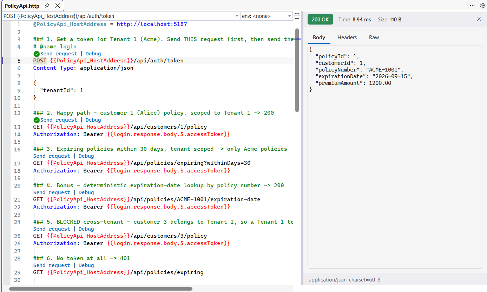
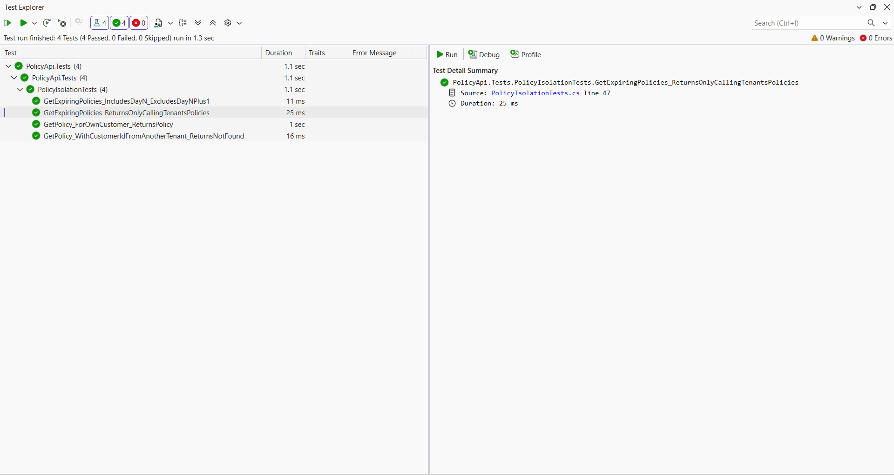

# Mini Multi-Tenant Policy API

An ASP.NET Core (minimal API) service on **.NET 10**, **EF Core 10** then **SQL Server LocalDB**. It serves read-only policy endpoints that are strictly isolated per tenant, protected by JWT bearer auth where the tenant identity is carried in the token.

## How to run

Prerequisites: .NET 10 SDK plus SQL Server LocalDB (the `MSSQLLocalDB` instance).

```bash
dotnet restore
dotnet run --project PolicyApi
```

The app listens on `http://localhost:5187`. On startup it creates the `PolicyApiDb` LocalDB database (`EnsureCreated`) then seeds two tenants: **Tenant 1** (Acme, customers 1-2) plus **Tenant 2** (Globex, customers 3-4). Swagger UI is at **`http://localhost:5187/swagger`** with an **Authorize** button for the bearer token.

## Packages

- **Microsoft.EntityFrameworkCore.SqlServer** - ORM plus LocalDB provider.
- **Microsoft.AspNetCore.Authentication.JwtBearer** - JWT validation.
- **Swashbuckle.AspNetCore** - Swagger / OpenAPI UI.
- **xUnit**, **Microsoft.EntityFrameworkCore.Sqlite** (test project) - tests on SQLite in-memory.

## Testing the endpoints (`PolicyApi.http`)

Open `PolicyApi/PolicyApi.http` and use the **Send Request** links. Send request **1** (`login`) first to mint a Tenant 1 token; requests 2-7 reuse it inline via `{{login.response.body.$.accessToken}}`, so nothing is pasted by hand. The file also demonstrates the blocked cross-tenant request (Tenant 1 token -> another tenant's customer -> 404), a no-token 401 then an unknown-tenant 404.



## Unit tests

```bash
dotnet test
```

Four xUnit tests: the headline cross-tenant block, the happy path, tenant-scoped expiry then the `withinDays` boundary.



## How tenant isolation is enforced and why

Defence in depth across three layers:

1. **Resolve at the edge.** `TenantResolutionMiddleware` reads the tenant from the validated JWT `tid` claim (not a spoofable client header) then populates a scoped `ITenantContext`. It runs as middleware, not an endpoint filter, because a filter runs after handler arguments are bound - by which point the `DbContext` would already be built.
2. **Fail closed.** `ITenantContext.TenantId` throws if read before a tenant is resolved. It never defaults to `0`, `null` or "all tenants", so the failure mode is *no data*, never *someone else's data*.
3. **Enforce in the data layer.** EF Core global query filters scope every `Customer` plus `Policy` query to the current tenant. `Policy` has no `TenantId`, so its filter reaches through the customer relationship (`p.Customer.TenantId == tenantId`).

Enforcement lives in the data layer rather than in controllers because a per-endpoint check is one forgotten `if` away from a breach; a global filter is secure by default. A cross-tenant lookup returns **404, not 403**, so it cannot be used to confirm that an id exists in another tenant (an enumeration leak).

## What I would change to scale to real production data

- **Real identity provider** behind the token endpoint (credential checks, asymmetric signing keys from a secret store, refresh plus key rotation). The current token endpoint is a testing stand-in.
- **Denormalize `TenantId` onto `Policy`** (and every tenant-owned table) with a composite index plus a DB check constraint, so isolation no longer depends on a join.
- **Push enforcement below the app**: row-level security in SQL Server, or database-per-tenant for high-sensitivity tenants.
- **A cross-tenant integration suite in CI**, per-tenant cache keys, pagination plus an `ExpirationDate` index, audit logging of tenant context then EF **migrations** in place of `EnsureCreated`.
